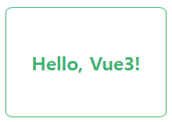

# PracticeVue

This Repasitory is created to summarize and practise Vue.js personally  
Summarised page (lang: 🇰🇷 ) : <a href="https://docs.google.com/document/d/1LH9aIY65pXWYbk2Q-oYkcw0aurU1EkZqBlGj_UIUjdQ/edit?usp=sharing">Summary Docs</a>  
You can check example codes and descriptions in <a href="https://github.com/smileJanet/PracticeVue/tree/main/VuePracticeWithVite/src">here<a> about Summary Docs.
